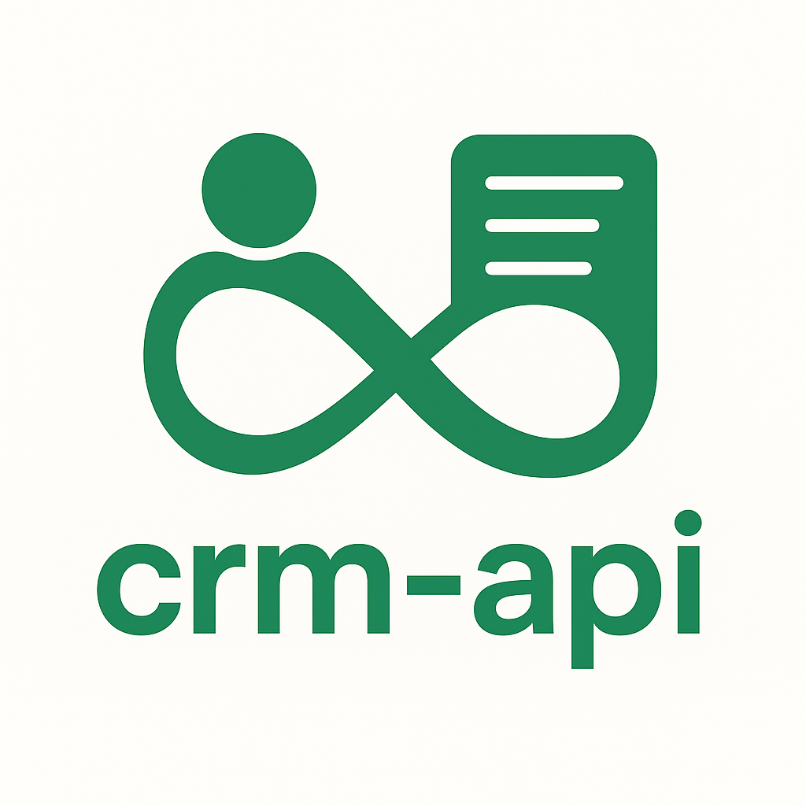

<br>

<br>


[](https://github.com/BodaliciousCelestius/crm-api/actions/workflows/ci.yml)
[](https://github.com/BodaliciousCelestius/crm-api/actions/workflows/ci.yml)
[](https://github.com/BodaliciousCelestius/crm-api/actions/workflows/ci.yml)
[](https://github.com/BodaliciousCelestius/crm-api/actions/workflows/ci.yml)
[](https://github.com/BodaliciousCelestius/crm-api/actions/workflows/ci.yml)

## Description

`crm-api` is a backend system designed for insurance companies to manage clients and contracts. 

As a counselor, you can create clients, create contracts for them, and manage both clients and their associated contracts. The API is fully RESTful, JSON-based, and adheres to ISO 8601 date standards with validation on dates, phone numbers, emails, and numeric fields.

Built with Java 21, Spring Boot, WebFlux, and Reactor, the system leverages ReactiveMongoRepository for MongoDB interactions. It is fully tested, with Jacoco reporting a code coverage of 88%.

---
## Features

* RESTful API for managing clients and contracts
* ISO 8601 compliant date handling
* Validation on dates, emails, phone numbers, and numbers
* Reactive MongoDB integration with WebFlux and Reactor
* Fully tested with Jacoco coverage
* CI/CD via GitHub Actions with Maven caching and static analysis (SpotBugs, PMD, Checkstyle)
* Dockerized application and docker-compose setup for local development
* Multi-environment configuration (dev, prod, docker)
* Maven Spotless plugin for code formatting

---

## Architecture & Design

The project follows a **layered architecture** ensuring maintainability and scalability:

```
controller → service → repository → database
```

* **Controller:** Handles REST endpoints and validation.
* **Service:** Contains business logic (updates, filtering, date validation, cost sum computation).
* **Repository:** Spring Data MongoDB for persistence.
* **Model/DTOs:** Separate data objects for domain and API exposure.

The application is also using **Spring Boot WebFlux** for reactive programming and **ReactiveMongoRepository** for non-blocking data access. Controllers handle HTTP requests and delegate logic to service layers, ensuring separation of concerns. 

Reactive streams (Mono/Flux) provide backpressure and scalability for concurrent workloads. This design ensures high performance, testability, and efficient resource usage while maintaining a clear, maintainable codebase.

**Rationale:**

* MongoDB fits naturally with JSON and evolving schemas.
* Layered design isolates business logic and promotes clean testing.
* Make use of low code technique when possible (annotations from OpenAPI, Lombok, Spring Data, ...)
* Testing is an obvious good practices that must be followed
* 
---

## Prerequisites
* Java `21`
* Docker `28.5.1`
* Docker Compose `2.40.0`

Maven is not necessary since a mvn wrapper is provided (`mvnw`) to use it when needed.

Don't forget to possibly alter the permission to be able to run it (`chmod +x mvnw`)

---

## Getting Started

### Run with Docker Compose

```bash
# Start the application with MongoDB
docker-compose up --build
```

### Run with Maven (without Docker)

The prerequisite for working this way is to already have a mongodb running and have the `application-dev.yml` setup correctly.

```bash
# Elevate mvnw privileges
chmod +x mvnw

# Build the application
./mvnw clean install

# Run the application
./mvnw spring-boot:run
```
API available at http://localhost:8080

Swagger UI available at http://localhost:8080/swagger-ui/

### Run tests

```bash
# Test the application
mvn clean test
```

## Configuration

The application configuration is split by environment:

* `application.yml` - Base configuration
* `application-dev.yml` - Local development
* `application-prod.yml` - Production
* `application-docker.yml` - Docker-specific (overrides DB host with container name)

## API Documentation

Once the application is running, access all REST endpoints and documentation via Swagger UI:

```
http://localhost:8080/swagger-ui/
```
From there you can also trigger HTTP requests with appropriate payloads to test the API yourself.
## Proof of Correctness

The correctness and compliance with technical specifications are asserted by three tenants :
* 74 unit and integration tests that confirm expected behavior
* A Jacoco code coverage monitoring currently reaching ~90%
* Simple manual testing with tools like curl and postman

All of this provide a strong foundation as to why the provided application is working properly.

## CI/CD

GitHub Actions pipeline is configured to:

1. Build, test and "verify" the application using Maven
2. Run static code analysis (SpotBugs, PMD, Checkstyle)
3. Upload Jacoco code coverage reports to artifacts
4. Trigger when push or PR merge is done on `main`
Maven caching is enabled for faster builds.

## Docker

*  Application container exposes port `8080`
* `Dockerfile` supports multi-stage builds: first builds the code, then runs it in a lightweight container
* `docker-compose.yaml` sets up both the CRM API and a MongoDB server for local testing

## Logging

The application enables logging via Slf4j and lombok.
It splits into 3 main levels :
* `INFO` : All executed operations and simple application flow.
* `WARN` : All error pertaining to the user and not crashing the app
* `ERROR` : Critical error for the app that aren't expected

The handling of log formatting is different based on the environment :
* `dev`, `docker`, `default` : A simple String standardized formatting using the Spring default formatter
* `prod` : A production ready formatting using JSON to be able to be ingested by cloud tooling.

## Code Formatting

Maven Spotless plugin ensures consistent code formatting across the project.

